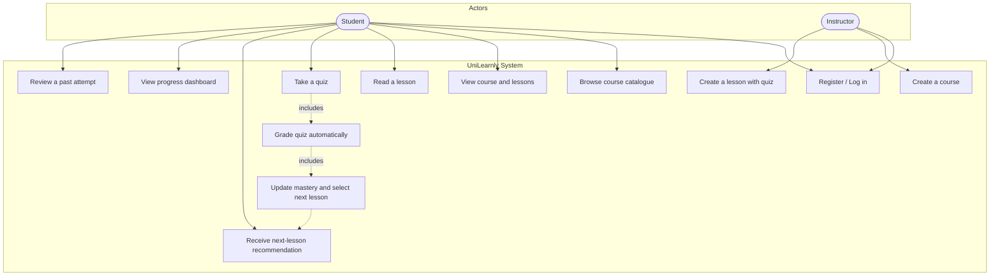
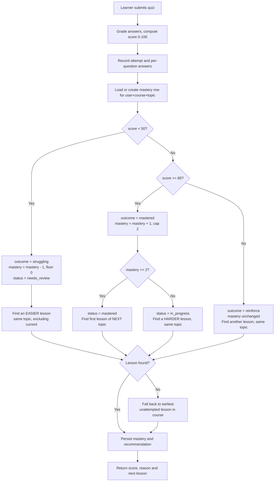

# UniLearnly — An Adaptive E-Learning Platform with a Rules-Based Recommendation Engine

> **DRAFT — read before submitting.**
>
> Everything marked **`[FILL IN]`** must be completed by the team. Everything
> else describes the system as actually built, and was checked against the
> running code and a live database rather than assumed.
>
> **Chapter Two is deliberately incomplete.** It contains a structure and a
> shortlist of starting references, but you must find, read and verify your own
> sources. Do not cite anything you have not opened.

---

## Title Page

**Project Title:** UniLearnly — An Adaptive E-Learning Platform with a Rules-Based Recommendation Engine

**Submitted by:**

| Name | Index / Registration Number | Level |
| ---- | --------------------------- | ----- |
| `[FILL IN]` | `[FILL IN]` | `[FILL IN]` |
| `[FILL IN]` | `[FILL IN]` | `[FILL IN]` |
| `[FILL IN]` | `[FILL IN]` | `[FILL IN]` |

**Course Code:** `[FILL IN]`
**Department:** `[FILL IN]`
**Supervisor:** `[FILL IN]`
**Date of Submission:** `[FILL IN]`

**Repository:** https://github.com/melo1dp/UniLearnly

---

## Abstract

Conventional online courses present every learner with the same material in the
same order, so faster learners are held back and struggling learners are left
behind. UniLearnly is a mobile e-learning platform that adapts each learner's
path automatically. After every quiz, a rules-based engine updates a per-topic
mastery level and selects the next lesson: remedial content when the learner is
struggling, harder content when they are succeeding, and a jump to a new topic
once mastery is demonstrated. The system was implemented as a React Native
application backed by a Node.js REST API and a PostgreSQL database, seeded with
13 courses, 117 lessons and 1,068 quiz questions. The adaptation engine is
covered by 17 automated tests. Testing confirmed that two learners taking the
same lesson receive different subsequent lessons according to their scores,
demonstrating adaptation end to end.

*(Word count: 138 — within the 100–150 requirement.)*

---

## Table of Contents

1. [Chapter One — Introduction](#chapter-one--introduction)
   - 1.1 Background
   - 1.2 Problem Statement
   - 1.3 Objectives
   - 1.4 Scope
   - 1.5 Significance
2. [Chapter Two — Literature Review](#chapter-two--literature-review)
   - 2.1 Related Concepts
   - 2.2 Related Works and Systems
3. [Chapter Three — Design and Methodology](#chapter-three--design-and-methodology)
   - 3.1 Methodology Used
   - 3.2 System Requirements
   - 3.3 Design Diagrams
4. [Chapter Four — Implementation and Results](#chapter-four--implementation-and-results)
   - 4.1 Tools Used
   - 4.2 How It Works
   - 4.3 Testing
5. [Chapter Five — Conclusion](#chapter-five--conclusion)
   - 5.1 Summary
   - 5.2 Limitations
   - 5.3 Recommendations
6. [References](#references)
7. [Appendices](#appendices)

---

# Chapter One — Introduction

## 1.1 Background

Online learning platforms have made course material widely available, but most
deliver that material in a fixed sequence. Every learner on a given course sees
the same lessons in the same order regardless of what they already understand.
This is a consequence of how the content is modelled: a course is stored as an
ordered list, and progression means advancing an index through that list.

Adaptive learning systems instead treat the learner's demonstrated performance
as an input to the sequencing decision. Rather than asking "what comes next in
the list?", they ask "what should *this* learner study next, given how they have
performed so far?" The idea is long-established in educational technology
research, and implementations range from simple conditional rules through
statistical mastery models to machine-learning approaches.

UniLearnly implements the first of these tiers — a transparent, rules-based
engine — and augments it with a lightweight per-topic mastery counter. The
decision to remain at this tier was deliberate and is justified in Section 1.4.

## 1.2 Problem Statement

Traditional online courses are "one size fits all". A learner who has already
mastered a topic must still work through introductory material, while a learner
who has not understood it is advanced regardless and accumulates gaps. Neither
outcome is visible to the platform, because the platform does not act on quiz
performance beyond displaying a score.

Concretely, three problems follow:

1. **No responsiveness to performance.** A quiz score is recorded and displayed
   but does not influence what the learner is shown next.
2. **No model of the individual learner.** The system stores what the learner
   has *done*, not what they appear to *know*.
3. **No visible reasoning.** Where recommendation does exist in commercial
   platforms, it is typically opaque; the learner cannot see why they were
   given a particular item.

## 1.3 Objectives

**Aim:** To design and implement a mobile e-learning platform that personalises
each learner's lesson sequence automatically, based on their quiz performance,
using a transparent and explainable rules-based engine.

**Specific objectives:**

1. To implement authentication and role separation for students and instructors.
2. To allow learners to browse courses, read lessons and take automatically
   graded quizzes on a mobile device.
3. To design and implement a rules-based adaptation engine that maintains a
   per-topic mastery level and selects each learner's next lesson.
4. To provide instructors with the ability to author courses, lessons and quiz
   questions from within the same application.
5. To present each learner with their progress, including mastery per topic and
   a reviewable history of the engine's decisions.
6. To validate the engine's behaviour through automated testing.

## 1.4 Scope

**In scope — delivered:**

- Mobile client for Android and iOS from a single React Native codebase, which
  also builds for the browser via React Native Web.
- Authentication with two roles (student, instructor), JWT-based.
- Course, lesson and quiz browsing and consumption.
- Automatic quiz grading with per-question feedback and explanations.
- A rules-based adaptation engine with configurable thresholds.
- Per-topic mastery tracking, scoped per course.
- A learner progress dashboard with charts and a reviewable attempt history.
- Instructor authoring of courses, lessons and quizzes.
- A seed curriculum of 13 courses, 117 lessons and 1,068 questions across
  computing, mathematics, science, social science and humanities.
- An automated test suite covering the adaptation engine.

**Deliberately out of scope:**

- Machine-learning or AI-based recommendation.
- Video streaming, file uploads and rich-text authoring.
- Payments, certificates and discussion forums.
- Offline mode and background synchronisation.
- Editing or deletion of existing content (the authoring flow is create-only).

**Justification for a rules-based engine over machine learning.** A machine
learning approach to sequencing requires training data from many learners, which
a project of this scale does not have and cannot ethically manufacture. It would
also produce a system whose decisions could not be explained line by line in
this report or demonstrated deterministically. A rules-based engine is
achievable within one semester, requires no training data, and — importantly for
assessment — every decision it makes can be traced to a specific threshold. The
lightweight mastery counter borrows the central idea of knowledge-tracing models
(a per-skill proficiency value updated by evidence) without their statistical
machinery.

## 1.5 Significance

For learners, the system demonstrates that a modest amount of logic applied to
existing quiz data can produce a genuinely individual path: two learners on the
same course, having answered the same quiz differently, are routed to different
lessons.

For instructors, it shows that adaptive delivery does not require specialised
content: the curriculum is ordinary lessons tagged with a topic and a difficulty,
and it is those two fields that make adaptation possible.

Academically, the project provides a working reference implementation of Tier-1
adaptive sequencing with a documented, tested decision procedure — a useful base
for later work substituting a statistical model for the fixed thresholds.

---

# Chapter Two — Literature Review

> **`[FILL IN — this chapter needs your own reading.]`**
>
> The structure below is sound and the framing is accurate to your system. What
> is missing is the evidence. Find and read 4–6 sources, then write 2.1 and 2.2
> in your own words with proper citations.
>
> **Do not cite any source you have not opened and read.** Fabricated or
> mis-attributed references are the single easiest form of academic misconduct
> for a marker to detect.

## 2.1 Related Concepts

Suggested structure — write each of these as a short paragraph in your own words,
with citations:

**Adaptive learning systems.** Define the term. Establish the three tiers below
and place this project explicitly in Tier 1.

| Tier | Approach | Typical example |
| ---- | -------- | --------------- |
| 1. Rules-based | Explicit conditional rules over performance (`if score < X then …`) | **This project** |
| 2. Knowledge / mastery models | Track a per-skill proficiency value updated probabilistically | Bayesian Knowledge Tracing |
| 3. Machine learning | Learn sequencing patterns from large learner datasets | Deep Knowledge Tracing |

**Knowledge tracing.** Explain the idea of maintaining a per-skill estimate of
learner proficiency, and how UniLearnly's integer `mastery_level` is a
simplified, deterministic analogue of it.

**Mastery learning.** The pedagogical principle that a learner should
demonstrate competence in a topic before advancing. Connect this to the
`MASTERY_TO_ADVANCE` threshold in your engine.

**Formative assessment.** Quizzes used to *direct* learning rather than only to
grade it. This is exactly the role quizzes play in your system, and it is worth
stating explicitly.

### Starting references

These four are real and well-known in the field. **Verify each one yourself** —
check the authors, year, venue and page numbers against the actual paper before
citing it, and read at least the abstract and conclusion.

- Corbett, A. T., & Anderson, J. R. (1994). Knowledge tracing: Modeling the
  acquisition of procedural knowledge. *User Modeling and User-Adapted
  Interaction*, 4(4), 253–278.
- Piech, C., Bassen, J., Huang, J., Ganguli, S., Sahami, M., Guibas, L., &
  Sohl-Dickstein, J. (2015). Deep Knowledge Tracing. *Advances in Neural
  Information Processing Systems*, 28.
- VanLehn, K. (2011). The relative effectiveness of human tutoring, intelligent
  tutoring systems, and other tutoring systems. *Educational Psychologist*,
  46(4), 197–221.
- Brusilovsky, P. (2001). Adaptive hypermedia. *User Modeling and User-Adapted
  Interaction*, 11(1–2), 87–110.

**Search terms** for finding the rest, via Google Scholar or your university
library: `adaptive learning systems`, `knowledge tracing`, `intelligent tutoring
systems`, `mastery learning`, `rule-based adaptive sequencing`, `personalised
e-learning`.

## 2.2 Related Works and Systems

Review **2–4** existing systems. For each, describe what it does, how it adapts
(if it does), and what its limitations are relative to your objectives. Candidates
you can genuinely investigate and cite:

- **Duolingo** — spaced repetition and difficulty adjustment in language learning.
- **Khan Academy** — mastery-based progression and skill trees.
- **ALEKS** — knowledge-space theory; explicitly adaptive and well documented.
- **Anki** — spaced repetition scheduling (relevant to your future-work section).

### Comparative analysis

Complete this table from your own reading. The final row is filled in for you
because it describes your system.

| System | Adaptation approach | Explainable to the learner? | Mobile-native? | Limitation |
| ------ | ------------------- | --------------------------- | -------------- | ---------- |
| `[FILL IN]` | `[FILL IN]` | `[FILL IN]` | `[FILL IN]` | `[FILL IN]` |
| `[FILL IN]` | `[FILL IN]` | `[FILL IN]` | `[FILL IN]` | `[FILL IN]` |
| `[FILL IN]` | `[FILL IN]` | `[FILL IN]` | `[FILL IN]` | `[FILL IN]` |
| **UniLearnly** | Rules-based thresholds + per-topic mastery counter | Yes — every decision returns a human-readable reason | Yes (React Native) | No statistical model; thresholds are fixed and hand-tuned |

### Gap identified

Suggested framing, to be supported by your sources: commercial adaptive
platforms are effective but proprietary and opaque — the learner is told what to
study next but not why, and the mechanism cannot be inspected. Research-grade
knowledge-tracing systems are transparent in principle but demand training data
and statistical infrastructure disproportionate to a small deployment. There is
room for a system that is genuinely adaptive, fully explainable, and simple
enough to be implemented and audited in its entirety.

---

# Chapter Three — Design and Methodology

## 3.1 Methodology Used

The project followed an **iterative and incremental (Agile-style)** development
methodology, appropriate because the requirements for the adaptation engine were
expected to be refined through observing its behaviour rather than fully
specified in advance.

Development proceeded in iterations, each producing a working increment:

| Iteration | Focus | Outcome |
| --------- | ----- | ------- |
| 1 | Data model and API skeleton | Schema, authentication, course and lesson endpoints |
| 2 | Curriculum authoring and seeding | 13 courses with validation at seed time |
| 3 | Quiz delivery and grading | Automatic grading, attempt recording |
| 4 | **Adaptation engine** | Rules, mastery tracking, next-lesson selection |
| 5 | Mobile client | Navigation, lesson reading, quiz taking, dashboard |
| 6 | Instructor authoring | Course and lesson creation from the app |
| 7 | Hardening and testing | Automated engine tests, security review, UI review |

Version control was used from the outset (Git and GitHub), with work committed in
themed increments.

**Testing approach.** Testing was performed continuously rather than as a final
phase. The adaptation engine — the project's core contribution — is covered by
automated unit tests; the API was exercised directly against a running server;
and the user interface was reviewed by driving the running application and
inspecting each screen. This is detailed in Section 4.3.

## 3.2 System Requirements

### 3.2.1 Functional Requirements

| ID | Requirement |
| -- | ----------- |
| FR1 | A visitor shall be able to register an account and log in. |
| FR2 | The system shall assign the student role on registration; instructor accounts shall be provisioned by an administrator. |
| FR3 | A learner shall be able to browse a catalogue of courses and search it by title. |
| FR4 | A learner shall be able to view a course and its lessons in teaching order. |
| FR5 | A learner shall be able to read a lesson. |
| FR6 | A learner shall be able to take a lesson's quiz and receive an automatically calculated score. |
| FR7 | The system shall record every quiz attempt, including the option chosen for each question. |
| FR8 | The system shall update the learner's mastery level for the lesson's topic after each quiz. |
| FR9 | The system shall recommend the next lesson based on the quiz score and current mastery. |
| FR10 | The system shall present a human-readable reason for every recommendation. |
| FR11 | A learner shall be able to view their progress: mastery per topic, quiz history and adaptation history. |
| FR12 | A learner shall be able to reopen any past attempt and review their answers with explanations. |
| FR13 | A learner shall be able to see which lessons in a course they have completed. |
| FR14 | An instructor shall be able to create a course. |
| FR15 | An instructor shall be able to create a lesson with an attached quiz. |
| FR16 | The system shall never disclose correct answers before a quiz is submitted. |

### 3.2.2 Non-Functional Requirements

| ID | Requirement |
| -- | ----------- |
| NFR1 | **Security.** Passwords shall be stored only as bcrypt hashes; API routes shall require a valid JWT; roles shall be assigned server-side. |
| NFR2 | **Explainability.** Every adaptation decision shall be traceable to a documented threshold. |
| NFR3 | **Usability.** Text shall meet WCAG AA contrast (4.5:1 for body text); interactive targets shall be at least 44pt. |
| NFR4 | **Reliability.** Recording an attempt and running the engine shall be atomic — either both succeed or neither does. |
| NFR5 | **Persistence.** Data shall survive restarts and redeployment of the API. |
| NFR6 | **Portability.** One codebase shall serve Android, iOS and the browser. |
| NFR7 | **Maintainability.** Adaptation thresholds shall be configurable in a single location. |

### 3.2.3 Hardware and Software Requirements

**Development:** Node.js 20.19.4 or later; npm 10+; Git; Android Studio (Android
emulator) or Xcode (iOS Simulator, macOS only); a PostgreSQL database.

**Deployment:** A Node.js host for the API (Render) and a managed PostgreSQL
instance (Neon). The web client is deployed as a static build (Netlify).

**End user:** An Android or iOS device, or a modern web browser, with an internet
connection.

## 3.3 Design Diagrams

> **Rendering note:** the diagrams below are written in Mermaid. Paste each block
> into https://mermaid.live to render it, then export as PNG and insert the image
> into your Word document. Label them Figure 3.1, 3.2 and 3.3.

### Figure 3.1 — Use Case Diagram



### Figure 3.2 — Entity Relationship Diagram

```mermaid
erDiagram
    USERS ||--o{ ATTEMPTS : submits
    USERS ||--o{ LEARNER_PROGRESS : has
    USERS ||--o{ RECOMMENDATIONS : receives
    COURSES ||--o{ LESSONS : contains
    COURSES ||--o{ LEARNER_PROGRESS : scopes
    LESSONS ||--|| QUIZZES : has
    QUIZZES ||--o{ QUESTIONS : contains
    QUIZZES ||--o{ ATTEMPTS : graded_by
    ATTEMPTS ||--o{ ATTEMPT_ANSWERS : records
    QUESTIONS ||--o{ ATTEMPT_ANSWERS : answered_in
    LESSONS ||--o{ RECOMMENDATIONS : from_lesson

    USERS {
        int id PK
        string name
        string email UK
        string password_hash
        string role
        timestamp created_at
    }
    COURSES {
        int id PK
        string title
        string description
        string category
        string level
        numeric rating
    }
    LESSONS {
        int id PK
        int course_id FK
        string title
        text body
        string topic
        string difficulty
        int position
    }
    QUIZZES {
        int id PK
        int lesson_id FK_UK
        string title
    }
    QUESTIONS {
        int id PK
        int quiz_id FK
        text text
        jsonb options
        int correct_index
        text explanation
    }
    ATTEMPTS {
        int id PK
        int user_id FK
        int quiz_id FK
        int score
        timestamp taken_at
    }
    ATTEMPT_ANSWERS {
        int attempt_id PK_FK
        int question_id PK_FK
        int chosen_index
        bool is_correct
    }
    LEARNER_PROGRESS {
        int user_id PK_FK
        int course_id PK_FK
        string topic PK
        int mastery_level
        string status
        timestamp updated_at
    }
    RECOMMENDATIONS {
        int id PK
        int user_id FK
        int lesson_id FK
        int next_lesson_id FK
        int score
        string outcome
        text reason
        int mastery
        string status
    }
```

**Design note worth defending in a viva.** `learner_progress` is keyed on
`(user_id, course_id, topic)` rather than `(user_id, topic)`. Topic names are
free text and repeat across the curriculum — `functions` is a topic in *Intro to
Programming*, *Python Basics* **and** *Algebra Foundations*. Keyed on topic
alone, a learner's algebra mastery and their Python mastery would share a single
row, and the engine would read one while deciding the other. This was found and
corrected during development.

### Figure 3.3 — Adaptation Engine Activity Diagram



---

# Chapter Four — Implementation and Results

## 4.1 Tools Used

| Layer | Technology | Justification |
| ----- | ---------- | ------------- |
| Mobile client | React Native + Expo (SDK 57) | One codebase targeting Android, iOS and the browser; Expo removes most native build configuration. |
| Navigation | Expo Router | File-based routing; a single route guard replaces per-screen authentication wrappers. |
| Charts | react-native-svg | Progress visualisations that render identically on all three platforms. |
| Token storage | expo-secure-store | Stores the JWT in the iOS Keychain / Android Keystore rather than plain storage. |
| Backend | Node.js + Express | Lightweight, well-documented, straightforward REST. |
| Database | PostgreSQL (Neon) | Relational model fits the data; managed hosting persists independently of the API container. |
| Authentication | JSON Web Tokens + bcrypt | Stateless authentication; passwords never stored in recoverable form. |
| Testing | Node.js built-in test runner | No additional dependency; sufficient for unit-testing the engine. |
| Version control | Git + GitHub | Change history and collaboration across three team members. |
| Deployment | Render (API), Netlify (web build) | Free tiers adequate for demonstration. |

**Project size.** Approximately 2,000 lines of backend application code, 4,150
lines of mobile client code, and a further 9,861 lines of curriculum content
data, across 9 database tables and 14 API endpoints.

## 4.2 How It Works

### 4.2.1 System Architecture

A three-tier architecture with a native mobile client as the presentation tier:

```
┌─────────────────────────────────────────────────┐
│  PRESENTATION — React Native (Expo)             │
│  Login · Catalogue · Lesson · Quiz · Dashboard  │
│  JWT held in the device keychain                │
└───────────────────────┬─────────────────────────┘
                        │  HTTPS / JSON (REST)
                        │  Authorization: Bearer <token>
┌───────────────────────▼─────────────────────────┐
│  APPLICATION — Node.js + Express                │
│  ┌──────────┐   ┌───────────────────────────┐   │
│  │  Auth    │   │ Courses / Lessons / Quiz  │   │
│  │  (JWT)   │   └────────────┬──────────────┘   │
│  └──────────┘                │ on quiz submit   │
│                   ┌──────────▼───────────────┐  │
│                   │  ★ ADAPTATION ENGINE     │  │
│                   │  (rules + mastery)       │  │
│                   └──────────────────────────┘  │
└───────────────────────┬─────────────────────────┘
                        │  SQL (node-postgres)
┌───────────────────────▼─────────────────────────┐
│  DATA — PostgreSQL (Neon)                       │
│  9 tables · users, courses, lessons, quizzes,   │
│  questions, attempts, attempt_answers,          │
│  recommendations, learner_progress              │
└─────────────────────────────────────────────────┘
```

### 4.2.2 The Adaptation Engine

The engine (`backend/src/engine/adaptation.js`) runs inside the same database
transaction as the quiz submission. Its thresholds are declared in one place:

```js
export const RULES = {
  STRUGGLING_BELOW: 50,      // below this % the learner is struggling
  MASTERED_AT_OR_ABOVE: 80,  // at or above this % they have mastered it
  MASTERY_TO_ADVANCE: 2,     // mastery needed before skipping to a new topic
};
```

The rules applied:

```
if score < 50%:                      # STRUGGLING
    mastery -= 1  (floored at 0)
    status  = needs_review
    next    = an EASIER lesson on the same topic

elif score >= 80%:                   # MASTERED
    mastery += 1  (capped at 2)
    if mastery >= 2:
        status = mastered
        next   = first lesson of the NEXT topic   (skip ahead)
    else:
        next   = a HARDER lesson on the same topic

else:                                # 50-79% — REINFORCE
    status = in_progress
    next   = another lesson on the same topic
```

Every branch excludes the lesson just taken. This matters: the difficulty ladder
has only three rungs and the step function clamps at both ends, so without an
exclusion a learner who failed an *easy* lesson would be handed that same lesson
back — an unbreakable loop for exactly the learner the system exists to help.
This defect was present in an earlier version and is now prevented by two
regression tests (Section 4.3).

**Worked example, captured from the running system:**

| Learner action | Score | Engine outcome | Next lesson served |
| -------------- | ----- | -------------- | ------------------ |
| Answers *Arrays and Indexing* (arrays / easy) partially | 53% | `reinforce`, mastery unchanged at 0 | *Inserting and Removing Elements* (arrays / **medium**) |
| Aces *Arrays and Indexing* (arrays / easy) | 100% | `mastered`, mastery 0 → 1 | *Inserting and Removing Elements* (arrays / **medium**) |
| Aces that too | 100% | `mastered`, mastery 1 → **2** | *Key-Value Lookups with Hash Maps* (**hash-maps** / easy) |
| Fails *Arrays and Indexing* (arrays / easy) | 0% | `struggling`, mastery stays 0 | *Inserting and Removing Elements* — **not** the failed lesson |

The third row is the one to demonstrate: mastery reaching the threshold promotes
the learner out of the topic entirely rather than merely to a harder lesson
within it.

### 4.2.3 API Endpoints

| Method & path | Auth | Purpose |
| ------------- | ---- | ------- |
| `GET /api/health` | – | Liveness probe; also verifies database connectivity |
| `POST /api/auth/register` | – | Create a student account, returns JWT |
| `POST /api/auth/login` | – | Authenticate, returns JWT |
| `GET /api/auth/me` | token | Current user |
| `PATCH /api/auth/password` | token | Change own password |
| `GET /api/courses` | token | List courses with their topics |
| `GET /api/courses/:id` | token | Course, its lessons, and this learner's completion |
| `POST /api/courses` | instructor | Create a course |
| `GET /api/lessons/:id` | token | Lesson content and its quiz reference |
| `POST /api/lessons` | instructor | Create a lesson, optionally with a quiz |
| `GET /api/quizzes/:id` | token | Quiz questions (**never** the answers) |
| `POST /api/quizzes/:id/submit` | token | Grade, record, and run the engine |
| `GET /api/attempts/:id` | token | Reopen a past attempt for review |
| `GET /api/progress` | token | Mastery, attempts, adaptation history |

### 4.2.4 The Seed Curriculum

Curriculum content lives in `backend/src/db/content/`, one module per course,
separate from the insertion logic. **13 courses · 39 topics · 117 lessons ·
1,068 questions.** Every topic carries an easy, a medium and a hard lesson — a
hard requirement, because the engine's "give me something easier/harder on this
topic" query returns nothing if a rung of the ladder is missing.

Two safeguards run before the database is touched:

- **Validation.** Every topic is checked for all three difficulties, every
  `correct_index` for being inside its options array, and every option set for
  blanks and duplicates. A malformed course aborts the seed rather than
  producing a database the engine cannot navigate.
- **Answer-key shuffling.** Hand-written quizzes drift toward putting the correct
  answer first. Options are deterministically shuffled at seed time using a PRNG
  keyed by the question text, so a reset is reproducible, and `correct_index` is
  remapped to follow its answer. Measured distribution after shuffling:
  25% / 26% / 24% / 26%.

### 4.2.5 User Interface

> Insert the images from `docs/screenshots/` and caption them as below.

| Figure | File | Caption |
| ------ | ---- | ------- |
| 4.1 | `fig-01-login.png` | Login screen |
| 4.2 | `fig-02-catalogue.png` | Course catalogue with search, filters and learning snapshot |
| 4.3 | `fig-03-course-detail.png` | Course detail showing completed lessons and best scores |
| 4.4 | `fig-04-lesson.png` | Lesson reading screen with formatted code block |
| 4.5 | `fig-05-quiz.png` | Quiz with unanswered-question indicators |
| 4.6 | `fig-06-dashboard.png` | Progress dashboard with the "Continue learning" recommendation |
| 4.7 | `fig-07-adaptive-path.png` | Adaptation history and reviewable attempt list |
| 4.8 | `fig-08-attempt-review.png` | Reopened attempt with per-question feedback |
| 4.9 | `fig-09-profile.png` | Profile with statistics, weekly goal and achievements |

**Accessibility.** Interactive controls carry accessibility roles and labels;
quiz options are exposed as radio buttons with checked state; and body text meets
the WCAG AA contrast ratio of 4.5:1. Contrast was measured rather than assumed —
an earlier palette placed white text on the amber accent at 2.07:1, which failed
AA and was corrected to 9.3:1 by using dark ink on the same accent.

## 4.3 Testing

Testing was carried out at three levels.

### 4.3.1 Unit Testing — the Adaptation Engine

`npm test` runs **17 automated tests** over the adaptation engine using the
Node.js built-in test runner. The engine accepts its database handle as a
parameter, so the tests exercise the real decision path against an in-memory
substitute for PostgreSQL: no database is required and the suite completes in
approximately one second.

| # | Test | Expected | Result |
| - | ---- | -------- | ------ |
| 1 | Score below threshold on a medium lesson | `struggling`, easier lesson, same topic | ✅ Pass |
| 2 | Score below threshold on an **easy** lesson | Must **not** return the failed lesson | ✅ Pass |
| 3 | Mastery decrements but floors at zero | mastery stays 0 | ✅ Pass |
| 4 | Score of 49 | `struggling` | ✅ Pass |
| 5 | First pass at 100% | mastery 0→1, harder lesson, same topic | ✅ Pass |
| 6 | Second pass reaching threshold | mastery →2, advance to next topic | ✅ Pass |
| 7 | 100% on a **hard** lesson below threshold | Must **not** return the passed lesson | ✅ Pass |
| 8 | Repeated passes at maximum mastery | mastery capped, not inflated | ✅ Pass |
| 9 | Score of exactly 80 | `mastered` | ✅ Pass |
| 10 | Mid-range score | `reinforce`, same topic, excludes current lesson | ✅ Pass |
| 11 | Mid-range score | mastery unchanged | ✅ Pass |
| 12 | Score of exactly 50 | `reinforce`, not `struggling` | ✅ Pass |
| 13 | Score of 79 | `reinforce`, not `mastered` | ✅ Pass |
| 14 | Same topic name in two different courses | Mastery tracked separately per course | ✅ Pass |
| 15 | Recommendation persisted | Row records outcome, score and next lesson | ✅ Pass |
| 16 | Two learners, same lesson, different scores | Different next lessons (easy vs hard) | ✅ Pass |
| 17 | Unknown lesson id | Rejected, not silently adapted | ✅ Pass |

**Verification that the tests are meaningful.** Tests 2 and 7 are regression
tests for a real defect. To confirm they actually detect it, the fix was
temporarily reverted and the suite re-run: exactly those two tests failed and no
others. The fix was then restored and all 17 passed.

Test 16 asserts the project's central claim directly — it submits 20% and 95%
against the same lesson and asserts that the recommended next lessons differ.

### 4.3.2 Integration Testing — the API

Each endpoint was exercised against a running server with a live database.

| Test | Expected | Result |
| ---- | -------- | ------ |
| Log in with valid credentials | 200 with token | ✅ Pass |
| Log in with wrong password | 401 | ✅ Pass |
| Request a protected route with no token | 401 | ✅ Pass |
| Student attempts to create a course | 403 Forbidden | ✅ Pass |
| Register requesting the instructor role | Account created as **student** | ✅ Pass |
| Register with a 5-character password | 400 Bad Request | ✅ Pass |
| Register with a malformed email | 400 Bad Request | ✅ Pass |
| `GET /api/courses/abc` (non-numeric id) | 400 Bad Request | ✅ Pass |
| `GET /api/nope` | JSON 404 | ✅ Pass |
| Internal error triggered | Generic message; no table or column names leaked | ✅ Pass |
| `GET /api/quizzes/:id` inspected for answers | No `correct_index` present | ✅ Pass |
| Submit quiz with some questions skipped | Skipped stored as NULL, distinct from wrong | ✅ Pass |
| Reopen a past attempt | All 15 questions returned with choices | ✅ Pass |
| Request another learner's attempt | 404 (scoped by user) | ✅ Pass |

### 4.3.3 System Testing — Data Integrity and Interface

| Test | Expected | Result |
| ---- | -------- | ------ |
| Curriculum validator over all 13 courses | No structural defects | ✅ Pass |
| Every `correct_index` within its options array | 1,068 / 1,068 valid | ✅ Pass |
| Every question has at least 2 options | 1,068 / 1,068 valid | ✅ Pass |
| Every lesson has a quiz | 117 / 117 | ✅ Pass |
| Every topic has all three difficulties | 39 / 39 topics | ✅ Pass |
| Answer-key distribution after shuffling | No dominant option | ✅ 25/26/24/26 |
| Application renders on Android, iOS and web | No runtime errors | ✅ Pass |
| Browser console during a full user journey | No errors | ✅ Pass |

### 4.3.4 Defects Found and Corrected

Reported honestly; each was invisible to the layer above it.

1. **The engine could recommend the lesson just failed.** The difficulty step
   clamps at both ends of the three-rung ladder, and the struggling branch passed
   no exclusion. A learner failing an easy lesson was routed back into it
   indefinitely. Manual walkthroughs never caught this because they always began
   from a medium lesson. Fixed, and covered by tests 2 and 7.
2. **Registration trusted a client-supplied role.** The authoring routes were
   correctly gated, but the unauthenticated registration endpoint copied `role`
   straight from the request body — so anyone could register as an instructor.
   The "student receives 403" test passed throughout, because the gate was never
   the weakness.
3. **Mastery was keyed on a bare topic name,** causing collisions between
   courses sharing a topic name (Section 3.3).
4. **The quiz attempt was committed before adaptation ran,** in a separate
   transaction. An engine failure left the attempt recorded, mastery not updated,
   and the learner shown an error for a quiz that had in fact counted.
5. **Contrast failure on every primary button.** White on the amber accent
   measured 2.07:1 against a WCAG AA requirement of 4.5:1.
6. **Concurrent database resets clobbered each other,** because the seed script
   took no lock, and then reported success over an empty database.

---

# Chapter Five — Conclusion

## 5.1 Summary

This project set out to build a mobile e-learning platform that adapts each
learner's path to their demonstrated performance. All six objectives in Section
1.3 were met. The system delivers a curriculum of 13 courses, 117 lessons and
1,068 questions to a React Native client; grades quizzes automatically; maintains
a per-topic mastery level for each learner within each course; and selects each
learner's next lesson through a documented, tested set of rules that also returns
a human-readable justification.

The central claim — that the path is genuinely individual — is asserted directly
by an automated test and was reproduced against the live system: two learners
answering the same quiz differently receive different next lessons, and a learner
who demonstrates mastery twice is promoted out of the topic entirely.

## 5.2 Limitations

Stated plainly, as these bound what the results show.

1. **The engine considers only the most recent score.** It is a three-branch
   conditional over one number. It does not model *which* concepts were missed,
   despite per-question data now being recorded, nor does it weigh response time,
   attempt count or the learner's history beyond a single counter.
2. **Thresholds are fixed and hand-chosen.** 50%, 80% and a mastery target of 2
   are reasonable but not empirically derived.
3. **Recommendations do not cross course boundaries.** On finishing a course the
   engine has nothing further to suggest.
4. **Mastery does not decay.** A topic mastered months ago is still treated as
   mastered.
5. **No evaluation with real learners.** Correctness of the mechanism was tested;
   its *educational* effectiveness was not, and no claim is made about it.
6. **Content management is create-only.** There is no editing or deletion.
7. **Small quizzes narrow the middle band.** For a five-question quiz the
   attainable scores are 0/20/40/60/80/100, only one of which falls in the
   50–79% reinforce band.
8. **The rate limiter is in-memory,** so its counters reset on restart and would
   not be shared across multiple instances.

## 5.3 Recommendations

**For future development:**

1. **Use the per-question data.** `attempt_answers` now records every choice.
   Diagnosing *which* concept was missed, rather than only that the total was
   low, is the single most valuable extension and requires no new data capture.
2. **Replace fixed thresholds with a knowledge-tracing model.** Bayesian
   Knowledge Tracing would be the natural Tier-2 successor and the data model
   already supports it.
3. **Add spaced-repetition scheduling** so weak topics resurface over time, and
   let mastery decay.
4. **Add instructor analytics** — average score per topic, weakest topics across
   a cohort — so authors can see which lessons underperform.
5. **Allow editing and deletion** of existing content.
6. **Evaluate with real learners,** comparing outcomes against a fixed-sequence
   control group. This is what would turn a working mechanism into evidence that
   it helps.

**For others attempting similar work:**

- Test the decision logic automatically and early. The most serious defect in
  this project survived repeated manual demonstration because the manual route
  never happened to traverse it.
- Verify assumptions by measurement. Both the contrast failure and the
  answer-key bias were found by measuring, not by looking.

---

# References

> **`[FILL IN]`** — format according to your department's required style (APA or
> IEEE). Include every source cited in Chapter Two, and only sources you have
> actually read. The four listed in Section 2.1 are starting points that you must
> verify independently.

---

# Appendices

**Appendix A — Source Code.** Full source is available at
https://github.com/melo1dp/UniLearnly. Key files:

| Path | Contents |
| ---- | -------- |
| `backend/src/engine/adaptation.js` | The adaptation engine |
| `backend/src/engine/adaptation.test.js` | Its 17 automated tests |
| `backend/src/db/schema.sql` | The 9-table schema with indexes |
| `backend/src/routes/` | API endpoints |
| `mobile/app/` | Application screens (file-based routes) |

**Appendix B — Screenshots.** See `docs/screenshots/`, reproduced as Figures
4.1–4.9 in Section 4.2.5.

**Appendix C — User Manual.** `[FILL IN if required]` — installation and run
instructions are in the repository `README.md` and can be adapted.

**Appendix D — Plagiarism Report.** `[FILL IN if required]`
